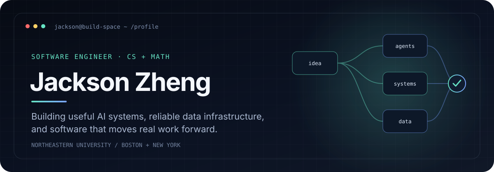

<p align="center">
  
</p>

<p align="center">
  <a href="https://www.linkedin.com/in/jackson-zheng-844172247/"></a>
  <a href="mailto:Jacksonzheng425@gmail.com"></a>
  
</p>

<br />

<table>
<tr>
<td width="58%" valign="top">

### `01 / CURRENTLY`

I’m a **Computer Science + Mathematics** student in Northeastern University’s Honors Program, working where software engineering, machine learning, and real-world automation overlap.

I’m especially interested in:

- data engineering and scalable infrastructure
- machine learning and intelligent automation
- systems, reliability, and developer tooling

</td>
<td width="42%" valign="top">

### `SYSTEM SNAPSHOT`

```yaml
name: Jackson Zheng
school: Northeastern University
studying: [Computer Science, Mathematics]
exploring:
  - ML systems
  - data automation
  - scalable infrastructure
status: building
```

</td>
</tr>
</table>

<br />

### `02 / BUILD SPACE`

<table>
<tr>
<td width="33%" valign="top">

#### ◇ Intelligent Systems

Exploring practical ways to connect machine learning with useful software and real-world workflows.

</td>
<td width="33%" valign="top">

#### ◇ Data + Automation

Building tools that turn repetitive processes and scattered information into reliable systems.

</td>
<td width="33%" valign="top">

#### ◇ Infrastructure

Learning how scalable, observable, and resilient software behaves beyond the happy path.

</td>
</tr>
</table>

<br />

### `03 / TOOLBOX`

<p>
  
</p>

<sub>Languages, frameworks, and infrastructure are tools—the interesting part is choosing the right ones for the system.</sub>

<br />

### `04 / GITHUB TRANSMISSION`

<p align="center">
  
  
</p>

<br />

<p align="center">
  <code>build → measure → learn → refine</code>
</p>
