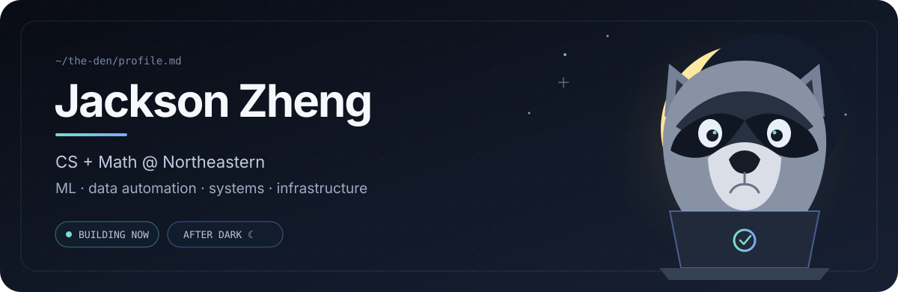

<p align="center">
  
</p>

<p align="center">
  <a href="https://www.linkedin.com/in/jackson-zheng-844172247/"></a>
  <a href="mailto:Jacksonzheng425@gmail.com"></a>
  
</p>

<br />

<table>
<tr>
<td width="58%" valign="top">

### `01 / THE DEN`

I’m a **second-year Computer Science + Mathematics student at Northeastern University** in the Honors Program.

I like building around the intersection of:

- data engineering and machine learning
- automation and scalable infrastructure
- systems, reliability, and real-world impact

</td>
<td width="42%" valign="top">

### `CURRENT STATUS`

```yaml
handle: JacksonZheng07
species: night-shift builder
school: Northeastern
year: second-year
studying: [CS, Math]
status: collecting hard problems
```

</td>
</tr>
</table>

<br />

### `02 / WHAT'S IN THE TRASH CAN?`

<table>
<tr>
<td width="33%" valign="top">

#### 🦝 Data

Turning scattered information into structured, useful systems.

</td>
<td width="33%" valign="top">

#### 🌙 Automation

Building software that handles repetitive work reliably.

</td>
<td width="33%" valign="top">

#### ⚙️ Infrastructure

Learning how systems scale, fail, recover, and improve.

</td>
</tr>
</table>

<br />

### `03 / TOOL STASH`

<p align="center">
  
</p>

<br />

### `04 / NIGHT-SHIFT ACTIVITY`

<p align="center">
  
  
</p>

<br />

<p align="center">
  <code>scavenge ideas · build useful things · ship after dark</code>
</p>
